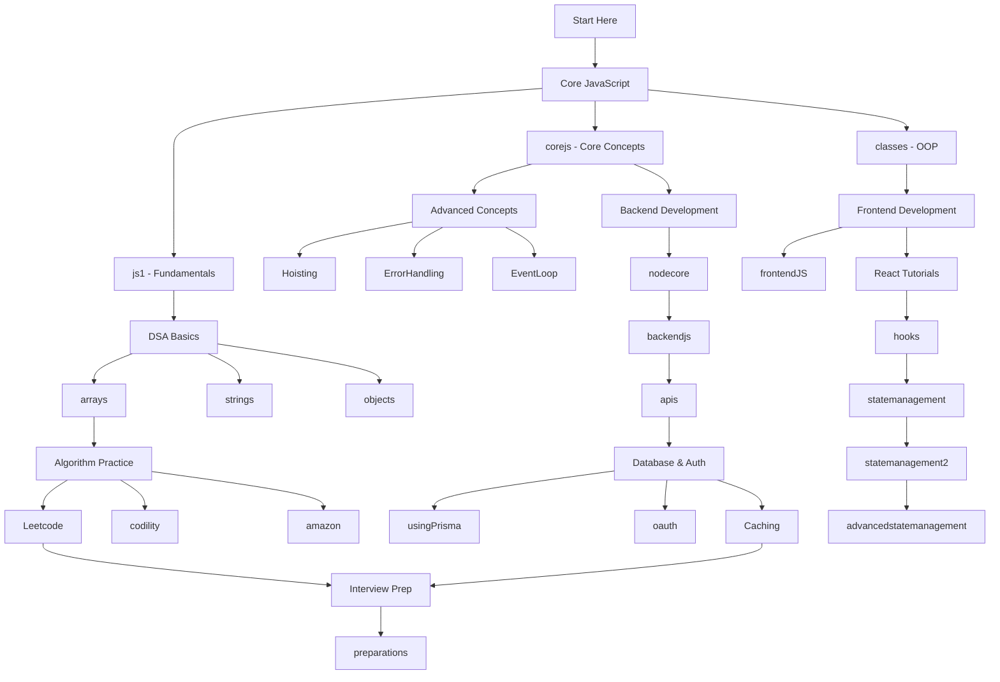

# JavaScript Playground 

A comprehensive collection of JavaScript, TypeScript, React, and Node.js projects, algorithms, and coding challenges. This repository serves as both a learning resource and a reference for various programming concepts and implementations.

## Table of Contents

- [Overview](#overview)
- [Repository Structure](#repository-structure)
- [Core Topics](#core-topics)
- [Getting Started](#getting-started)
- [Project Categories](#project-categories)
- [Learning Path](#learning-path)
- [Contributing](#contributing)

## Overview

This repository contains a wide range of JavaScript projects, from fundamental concepts to advanced implementations. Whether you're learning JavaScript, preparing for technical interviews, or building production applications, you'll find relevant examples and implementations here.

## Repository Structure

```
Javascript-playground/
├── algorithms-dsa/               # Data structures, algorithms & interview practice
│   ├── DSA/
│   ├── Leetcode/
│   ├── amazon/
│   ├── codility/
│   ├── arrays/
│   ├── strings/
│   └── preparations/
├── js-fundamentals/              # Core language concepts
│   ├── js1/
│   ├── corejs/
│   ├── classes/
│   ├── objects/
│   ├── Hoisting/
│   ├── ErrorHandling/
│   └── General/
├── react-frontend/                # React, state management & frontend UI
│   ├── hooks/
│   ├── statemanagement/
│   ├── statemanagement2/
│   ├── advancedstatemanagement/
│   ├── react-tuto/
│   ├── frontendJS/
│   ├── animations/
│   ├── forms/
│   └── modernlandingpage/
├── backend-node/                 # Node.js, APIs, databases & caching
│   ├── backendjs/
│   ├── nodecore/
│   ├── apis/
│   ├── usingPrisma/
│   ├── Caching/
│   └── web-meeting-server1/
├── auth-security/                # Authentication & access control
│   ├── oauth/
│   ├── githubAuth/
│   ├── social_authentication/
│   └── rolesbased/
├── projects/                     # Small full applications
│   ├── todoApp/
│   ├── Todo2/
│   └── SimpleGames/
├── files-media/                  # File system & media handling
│   ├── filesH/
│   └── media/
├── typescript/                   # TypeScript examples
└── LICENSE
```

## Core Topics

### Data Structures & Algorithms

#### [DSA](./algorithms-dsa/DSA/)
Fundamental data structures and algorithms implementations.

#### [Leetcode](./algorithms-dsa/Leetcode/)
Solutions to LeetCode problems with detailed explanations.

**Key Solutions:**
- Array problems (Two Sum, Merge Sorted Arrays, Maximum Subarray)
- String problems (Longest Substring, Anagram Checker, Valid Parenthesis)
- Linked Lists (Reverse Linked List, Merge Lists)
- Trees (Binary Search, DFS/BFS, Traversals)
- Dynamic Programming (Coin Change, Climbing Stairs, Kadane's Algorithm)
- Sorting Algorithms (Quick Sort, Merge Sort, Binary Search)
- Hash Tables (LRU Cache, Majority Element)
- Stacks & Queues
- Sliding Window problems
- Matrix problems (Spiral Matrix, Number of Islands)

**Files Include:**
- `AddNumbers.js`, `AnagramChecker.js`, `ArrayChunking.js`
- `Binary.js`, `climb.js`, `CoinsChange.js`
- `debouncing.js`, `dfs.js`, `duplicates.js`
- `EventLoopAndConcurrency.js`, `Factorial.js`, `Fibonnaci.js`
- `KadanesAlgorithm.js`, `LongestSubstring.js`, `LruCache.js`
- `MergeSortedArrays.js`, `MergeSort.js`, `QuickSort.js`
- `ReverseLinkedList.js`, `spiralMatrix.js`, `Sudoku.js`
- `validParenthesis.js`, and many more!

#### [Amazon Interview Questions](./algorithms-dsa/amazon/)
Common interview questions asked at Amazon.
- LRU Cache implementation
- Merge Sorted Arrays
- Reverse Linked List
- Tree problems
- Two Sum variants

#### [Codility Challenges](./algorithms-dsa/codility/)
Solutions to Codility coding challenges.
- `BinaryGap.js` - Binary representation problems
- `FrogRiverOne.js` - Array traversal
- `MaxCounters.js` - Counter operations
- `PassingCars.js` - Prefix sums
- `PermCheck.js` - Permutation checking
- `RateLimiter.js` - Rate limiting implementation
- `TapeEquilibrium.js` - Array splitting

#### [Arrays](./algorithms-dsa/arrays/)
Array manipulation techniques and algorithms.

#### [Strings](./algorithms-dsa/strings/)
String processing and manipulation problems.

### ⚛️ React & Frontend

#### [React Tutorials](./react-frontend/react-tuto/)
Comprehensive React.js tutorials and examples.

#### [Hooks](./react-frontend/hooks/)
React Hooks implementations and patterns.
- useState, useEffect, useContext
- Custom hooks
- Hook composition

#### [State Management](./react-frontend/statemanagement/)
Basic state management patterns in React.

#### [State Management v2](./react-frontend/statemanagement2/)
Redux + TypeScript state management built with Vite.

#### [Advanced State Management](./react-frontend/advancedstatemanagement/)
Advanced state management techniques.
- Redux patterns
- Context API advanced usage
- State machines
- Zustand, Recoil implementations

#### [Frontend JavaScript](./react-frontend/frontendJS/)
Frontend-specific JavaScript concepts.
- DOM manipulation
- Event handling
- Browser APIs
- Performance optimization

#### [Animations](./react-frontend/animations/)
Animation implementations and libraries.
- CSS animations
- JavaScript animations
- Animation libraries

#### [Forms](./react-frontend/forms/)
Form handling and validation.

#### [Modern Landing Page](./react-frontend/modernlandingpage/)
Modern landing page designs and implementations.

### 🔧 Backend & Node.js

#### [Backend JavaScript](./backend-node/backendjs/)
Backend JavaScript concepts and implementations.

#### [Node.js Core](./backend-node/nodecore/)
Core Node.js concepts and modules.
- Event loop
- Streams
- Buffer
- File system
- Networking

#### [APIs](./backend-node/apis/)
API development and integration.
- RESTful APIs
- GraphQL
- API design patterns

#### [Using Prisma](./backend-node/usingPrisma/)
Prisma ORM examples and best practices.
- Schema design
- Migrations
- Queries
- Relations

#### [Caching](./backend-node/Caching/)
Caching strategies and implementations.
- In-memory caching
- Redis integration
- Cache invalidation strategies

### Authentication & Security

#### [OAuth](./auth-security/oauth/)
OAuth implementation examples.

#### [GitHub Authentication](./auth-security/githubAuth/)
GitHub OAuth integration.

#### [Social Authentication](./auth-security/social_authentication/)
Social media authentication implementations.
- Google Auth
- Facebook Auth
- Twitter Auth

#### [Role-Based Access](./auth-security/rolesbased/)
Role-based access control (RBAC) implementations.

### 📱 Applications

#### [Todo App](./projects/todoApp/)
Full-featured todo application.

#### [Todo v2](./projects/Todo2/)
Enhanced version of todo application.

#### [Simple Games](./projects/SimpleGames/)
Simple game implementations in JavaScript.

#### [Web Meeting Server](./backend-node/web-meeting-server1/)
Web-based meeting server implementation.

### 💻 Core JavaScript Concepts

#### [Core JS](./js-fundamentals/corejs/)
Fundamental JavaScript concepts.

#### [JavaScript Fundamentals](./js-fundamentals/js1/)
Basic JavaScript programming concepts.

#### [Classes](./js-fundamentals/classes/)
JavaScript classes and OOP.

#### [Objects](./js-fundamentals/objects/)
Object-oriented programming in JavaScript.

#### [Hoisting](./js-fundamentals/Hoisting/)
Understanding JavaScript hoisting.

#### [Error Handling](./js-fundamentals/ErrorHandling/)
Error handling patterns and best practices.

#### [General Programming](./js-fundamentals/General/)
General programming concepts and patterns.

### 📘 TypeScript

#### [TypeScript Projects](./typescript/)
TypeScript implementations and examples.
- Type definitions
- Interfaces
- Generics
- Advanced types

### Interview Preparation

#### [Preparations](./algorithms-dsa/preparations/)
Interview preparation materials and strategies.

## Learning Path


```mermaid
graph TD
    A[Start Here] --> B[Core JavaScript]
    B --> C[js1 - Fundamentals]
    B --> D[corejs - Core Concepts]
    B --> E[classes - OOP]
    
    C --> F[DSA Basics]
    F --> G[arrays]
    F --> H[strings]
    F --> I[objects]
    
    G --> J[Algorithm Practice]
    J --> K[Leetcode]
    J --> L[codility]
    J --> M[amazon]
    
    D --> N[Advanced Concepts]
    N --> O[Hoisting]
    N --> P[ErrorHandling]
    N --> Q[EventLoop]
    
    E --> R[Frontend Development]
    R --> S[frontendJS]
    R --> T[React Tutorials]
    T --> U[hooks]
    U --> V[statemanagement]
    V --> V2[statemanagement2]
    V2 --> W[advancedstatemanagement]
    
    D --> X[Backend Development]
    X --> Z[nodecore]
    Z --> AA[backendjs]
    AA --> AB[apis]
    
    AB --> AC[Database & Auth]
    AC --> AD[usingPrisma]
    AC --> AE[oauth]
    AC --> AF[Caching]
    
    K --> AG[Interview Prep]
    AF --> AG
    AG --> AH[preparations]
```

## Getting Started

### Prerequisites

```bash
# Node.js and npm should be installed
node --version
npm --version
```

### Quick Start

1. **Clone the repository**
```bash
git clone https://github.com/Ritahchanger/Javascript-playground.git
cd Javascript-playground
```

2. **Choose a topic to explore**
```bash
# For DSA practice
cd algorithms-dsa/Leetcode

# For React learning
cd react-frontend/react-tuto

# For backend development
cd backend-node/nodecore

# For interview prep
cd algorithms-dsa/preparations
```

3. **Run examples**
```bash
# For Node.js files
node filename.js

# For projects with package.json
npm install
npm start
```

## Project Categories

### 🎓 Learning & Practice
- [DSA](./algorithms-dsa/DSA/)
- [Leetcode](./algorithms-dsa/Leetcode/)
- [Core JS](./js-fundamentals/corejs/)
- [JavaScript Fundamentals](./js-fundamentals/js1/)

### 💼 Interview Preparation
- [Amazon](./algorithms-dsa/amazon/)
- [Codility](./algorithms-dsa/codility/)
- [Preparations](./algorithms-dsa/preparations/)
- [Leetcode](./algorithms-dsa/Leetcode/)

### 🏗️ Full Projects
- [Todo App](./projects/todoApp/)
- [Modern Landing Page](./react-frontend/modernlandingpage/)
- [Web Meeting Server](./backend-node/web-meeting-server1/)
- [Simple Games](./projects/SimpleGames/)

### 📚 Tutorials & Guides
- [React Tutorials](./react-frontend/react-tuto/)
- [Hooks](./react-frontend/hooks/)
- [State Management](./react-frontend/statemanagement/)
- [State Management v2](./react-frontend/statemanagement2/)
- [Node.js Core](./backend-node/nodecore/)

## Common Algorithms & Patterns

### Array Algorithms
- Two Pointers
- Sliding Window
- Prefix Sum
- Binary Search
- Sorting algorithms

### String Algorithms
- Pattern matching
- String manipulation
- Anagram detection
- Palindrome checking

### Tree Algorithms
- DFS (Depth First Search)
- BFS (Breadth First Search)
- Tree traversals (Inorder, Preorder, Postorder)
- Binary Search Trees

### Dynamic Programming
- Fibonacci sequences
- Coin change problems
- Climbing stairs
- Kadane's algorithm

### Data Structures
- Arrays & Hash Tables
- Linked Lists
- Stacks & Queues
- Trees & Graphs
- Heaps

## Key Concepts Covered

### JavaScript Fundamentals
- Variables & Scoping
- Functions & Closures
- Prototypes & Inheritance
- Async/Await & Promises
- Event Loop & Concurrency
- Currying & Functional Programming
- This keyword & Context
- WeakMap & Map

### React Concepts
- Component lifecycle
- State management
- Hooks (useState, useEffect, useContext, custom hooks)
- Context API
- Redux patterns
- Performance optimization

### Node.js Concepts
- Event-driven architecture
- Streams & Buffers
- File system operations
- HTTP servers
- Express.js
- Database integration

### System Design Patterns
- Caching strategies
- Rate limiting
- Authentication & Authorization
- API design
- Error handling
- Logging & Monitoring

## Code Quality

### Best Practices
- Clean code principles
- SOLID principles
- DRY (Don't Repeat Yourself)
- Error handling
- Code documentation
- Testing strategies

### Performance
- Time complexity analysis
- Space complexity analysis
- Algorithm optimization
- Memoization
- Debouncing & Throttling

## Useful Commands

```bash
# Navigate to specific topics
cd algorithms-dsa/DSA/
cd algorithms-dsa/Leetcode/
cd react-frontend/react-tuto/

# Run JavaScript files
node filename.js

# For React projects
npm install
npm start

# For Node.js projects
npm install
node index.js
```

## Study Recommendations

### Week 1-2: Fundamentals
1. Start with [js1](./js-fundamentals/js1/) - JavaScript basics
2. Explore [corejs](./js-fundamentals/corejs/) - Core concepts
3. Practice [arrays](./algorithms-dsa/arrays/) - Array manipulation
4. Study [strings](./algorithms-dsa/strings/) - String operations

### Week 3-4: Data Structures
1. [DSA](./algorithms-dsa/DSA/) - Fundamental structures
2. [Leetcode](./algorithms-dsa/Leetcode/) - Easy problems
3. Practice with [codility](./algorithms-dsa/codility/)

### Week 5-6: Advanced Algorithms
1. Continue [Leetcode](./algorithms-dsa/Leetcode/) - Medium problems
2. Study [amazon](./algorithms-dsa/amazon/) - Interview questions
3. Master sorting and searching algorithms

### Week 7-8: Frontend Development
1. [React Tutorials](./react-frontend/react-tuto/)
2. [Hooks](./react-frontend/hooks/) implementation
3. [State Management](./react-frontend/statemanagement/)
4. [Advanced State Management](./react-frontend/advancedstatemanagement/)

### Week 9-10: Backend Development
1. [Node.js Core](./backend-node/nodecore/)
2. [Backend JS](./backend-node/backendjs/)
3. [APIs](./backend-node/apis/)
4. [Using Prisma](./backend-node/usingPrisma/)

### Week 11-12: System Design & Auth
1. [Caching](./backend-node/Caching/) strategies
2. [OAuth](./auth-security/oauth/) & [Social Authentication](./auth-security/social_authentication/)
3. [Role-Based Access](./auth-security/rolesbased/)
4. Build full-stack projects

## Resources

### Internal Documentation
- Check individual directory README files for specific topics
- Review code comments for implementation details
- Examine test files for usage examples

### 🎥 Recommended Tutorials

| Tutorial 1 | Tutorial 2 |
|------------|------------|
| [](https://www.youtube.com/watch?v=Ed94u4VqTN0&t=1420s) | [](https://www.youtube.com/watch?v=lI1ae4REbFM&t=20853s) |

👉 Click any banner to watch the video.

### File Handling
- [filesH](./files-media/filesH/) - File operations
- [media](./files-media/media/) - Media processing

### Interview Resources
- [preparations](./algorithms-dsa/preparations/) - Interview strategies
- [Leetcode](./algorithms-dsa/Leetcode/) - Practice problems
- [amazon](./algorithms-dsa/amazon/) - Company-specific questions
- [codility](./algorithms-dsa/codility/) - Timed challenges

## Contributing

Contributions are welcome! Here's how you can help:

1. **Add new problems/solutions**
   - Place them in the appropriate directory
   - Include comments explaining the approach
   - Add time/space complexity analysis

2. **Improve existing solutions**
   - Optimize algorithms
   - Add alternative approaches
   - Improve documentation

3. **Create new projects**
   - Build example applications
   - Add tutorials
   - Create learning resources

4. **Fix bugs**
   - Report issues
   - Submit pull requests
   - Improve error handling

## Project Status

This is an active learning repository that is continuously updated with new problems, solutions, and projects.

## License

See [LICENSE](./LICENSE) file for details.

---

## Quick Reference

### Most Popular Directories
- 🔥 [Leetcode](./algorithms-dsa/Leetcode/) - 80+ problem solutions
- ⚛️ [React Tutorials](./react-frontend/react-tuto/) - Complete React guide
- 🚀 [Node.js Core](./backend-node/nodecore/) - Backend essentials
- 💾 [DSA](./algorithms-dsa/DSA/) - Data structures & algorithms

### Common Patterns to Study
- **Array**: Two pointers, sliding window, prefix sum
- **String**: Pattern matching, palindromes, anagrams
- **Trees**: DFS, BFS, traversals
- **Dynamic Programming**: Memoization, tabulation
- **Graphs**: Traversal, shortest path, cycles

### Time Complexity Cheat Sheet
- O(1) - Constant time
- O(log n) - Logarithmic (Binary search)
- O(n) - Linear (Array traversal)
- O(n log n) - Linearithmic (Merge sort, Quick sort)
- O(n²) - Quadratic (Nested loops)
- O(2ⁿ) - Exponential (Recursive Fibonacci)

---

**Happy Coding!** 🎉

Start exploring the directories and happy learning! For questions or suggestions, please open an issue.